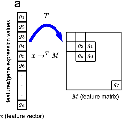

# tab2img: from tabular data to images
A tool to convert tabular data into images for CNN. Inspired by the [DeepInsight](https://www.nature.com/articles/s41598-019-47765-6) paper.

## Installation 
```
pip install tab2img
```

## Background

In the [paper](https://www.nature.com/articles/s41598-019-47765-6) "*DeepInsight: A methodology to transform a non-image data to an image for convolution neural network architecture*" the autors propose  a method to convert tabular data into images, in order to utilize the power of convolutional neural network (CNN) for non-image structured data.

<p align="center">
  
</p>

The Figure illustrates the main idea: given a training dataset $X \in \mathbb{R}^{m \times n}$ with $m$ samples and $n$ features, we are required to find a function $M \in \mathbb{R}^{m \times n} \to \mathbb{R}^{m \times d \times d}$, where $d = \lceil \sqrt{n} \rceil$. 

There are numerous ways to choose $M$. In this implementation, the features are organized with respect to the correlation vector $\rho(X,Y)$, where $Y \in \mathbb{R}^{1 \times m}$ is the target vector.
Given $X$ and $Y$ as

$$
X = \begin{bmatrix} x^{(1)}_1 & \cdots & x^{(1)}_n \\\ \vdots & \ddots & \vdots \\\ x^{(m)}_1 & \cdots & x^{(m)}_n \end{bmatrix}, \quad Y = \begin{bmatrix} y_1 \\\ \vdots \\\ y_m \end{bmatrix}
$$ 

Vector $\rho_i$ express the [Pearson correlation coefficient](https://en.wikipedia.org/wiki/Pearson_correlation_coefficient) for the $i$-th feature, i.e., 

$$
\rho_i = \rho(X_i, Y), \quad X_i = \begin{bmatrix} x^{(1)}_i \\\ \vdots \\\ x^{(m)}_i \end{bmatrix}
$$

In this case, being $X$ a sample, the correlation coefficient is implemented as 

$$
\rho(x,y) = \frac{\sum_{i=1}^{n}(x_{i}-{\bar {x}})(y_{i}-{\bar{y}})}{{\sqrt{\sum_{i=1}^{n}(x_{i}-{\bar{x}})^{2}}}{\sqrt{\sum_{i=1}^{n}(y_{i}-{\bar{y}})^{2}}}}
$$

At this point, $\rho_1, \dots, \rho_n$ are sorted from the greatest to the smallest, generating the vector of indices 

$$
J = \left[ J_k \in \mathbb{N}: \ \rho(X_{J_k}, Y) > \rho(X_{J_{k-1}}, Y), \ k = 2,\dots,n \right]
$$

Eventually, the final tensor $M$ is

$$
M = \begin{bmatrix} X_{J_1} & X_{J_2} & X_{J_5} & \cdots \\\ X_{J_3} & X_{J_4} & X_{J_7} & \cdots \\\ X_{J_6} & X_{J_8} & X_{J_9} & \cdots \\\ \vdots & \vdots & \vdots & \ddots \end{bmatrix}
$$

The mapping from $J_k$ to the right row and column $(r,c)_k$ of $M$ is 

$$
(r, c)_ k = \begin{cases} (\sqrt{k}, \sqrt{k}) & \text{if} \sqrt{k} \in \mathbb{N} \\\ (\lceil\sqrt{k}\rceil, \lceil\sqrt{k}\rceil - \frac{1}{2}(\lceil\sqrt{k}\rceil^2 - k)) & \text{if} \sqrt{k} \notin \mathbb{N} \ \text{and} \ \lceil\sqrt{k}\rceil^2 - k = 0 \mod{2} \\\ (\lceil\sqrt{k}\rceil - \frac{1}{2}(\lceil\sqrt{k}\rceil^2 - k), \lceil\sqrt{k}\rceil) & \text{if} \sqrt{k} \notin \mathbb{N} \ \text{and} \ \lceil\sqrt{k}\rceil^2 - k \neq 0 \mod{2} \end{cases}
$$

## Example

```python
from sklearn.datasets import fetch_covtype
from tab2img.converter import Tab2Img

dataset = fetch_covtype()

train = dataset.data
target = dataset.target

model = Tab2Img()
images = model.fit_transform(train, target)
```

